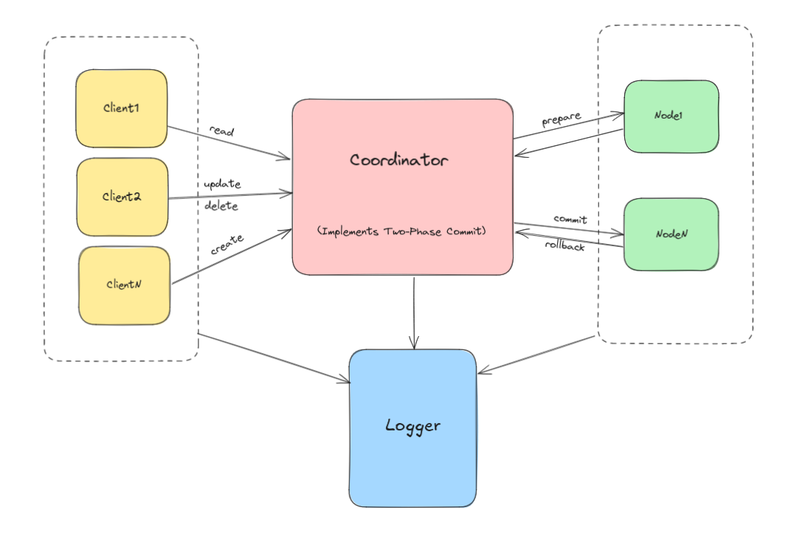

# OMPIStore

## Overview
OMPIStore is a **distributed and parallel key-value store** implemented using **MPI (Message Passing Interface)** and **OpenMP**. It allows multiple clients to interact with a distributed system consisting of a coordinator and multiple nodes. The system supports basic CRUD operations (Create, Read, Update, Delete) and uses a **Two-Phase Commit (2PC)** protocol to ensure consistency across nodes.

The key-value store is designed to be:
- **Distributed**: Data is stored across multiple nodes.
- **Parallel**: Operations are handled concurrently using MPI.
- **Fault-Tolerant**: The Two-Phase Commit protocol ensures data consistency even in the presence of failures.

---

## Features
- **CRUD Operations**:
    - **Create**: Add a new key-value pair.
    - **Read**: Retrieve the value associated with a key.
    - **Update**: Modify the value of an existing key.
    - **Delete**: Remove a key-value pair.
- **Two-Phase Commit (2PC)**:
    - Ensures atomicity and consistency across distributed nodes.
- **Interactive Client Interface**:
    - Clients can interact with the system using a command-line interface (CLI).
- **Performance Logging**:
    - Logs the time taken and memory usage for each operation.

---

## Prerequisites
To run this project, you need:
- **MPI**: Install MPI on your system.
    - On Ubuntu: `sudo apt install mpich`
    - On macOS: `brew install mpich`
- **OpenMP**: Ensure your compiler supports OpenMP (usually included with modern C++ compilers).
    - On Ubuntu: `sudo apt install libomp-dev`
    - On macOS: `brew install libomp`
- **C++ Compiler**: Ensure you have a C++ compiler that supports C++20.
- **Git**: To clone the repository.

---

## System Components
The system consists of the following components:

1. **Clients**:
    - Interact with the system by sending requests (CREATE, READ, UPDATE, DELETE).
    - Each client runs in its own terminal and communicates with the coordinator.
    - Use the Logger to log performance metrics and events.
2. **Coordinator**:
    - Acts as the central server.
    - Receives requests from clients and coordinates with nodes.
    - Implements the Two-Phase Commit (2PC) protocol to ensure consistency.
    - Uses the Logger to log coordination events and performance metrics.
3. **Nodes**:
    - Store key-value pairs.
    - Participate in the 2PC protocol by responding to prepare and commit requests.
    - Handle READ, CREATE, UPDATE, and DELETE operations.
    - Use the Logger to log node-specific events and performance metrics.
4. **Logger**:
    - A centralized logging component used by all parts of the system.
    - Logs performance metrics and system events to a file or console.

---

## Installation
1. Clone the repository:
   ```bash
   git clone https://github.com/ahmed-ashraff/OMPIStore.git
   cd OMPIStore
   ```
2. Build the project 
   ```bash
   make build
   ```
---

## Two-Phase Commit (2PC) Protocol
The system uses a Two-Phase Commit (2PC) protocol to ensure consistency across nodes:

1. **Prepare Phase**:
   - The coordinator sends a prepare request to all nodes.
   - Nodes respond with a vote (commit or abort).
2. Commit Phase:
   - If all nodes vote to commit, the coordinator sends a commit request.
   - If any node votes to abort, the coordinator sends an abort request.

---

## System Overview

